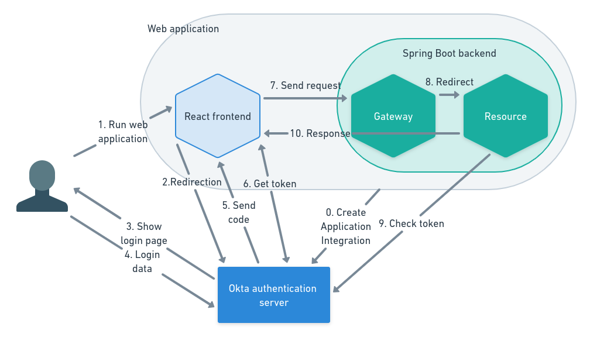

# spring-okta
The projects in this repo illustrate the application of the [OAuth 2.0 authorization framework](https://www.rfc-editor.org/rfc/rfc6749) using the [Okta autherization server](https://developer.okta.com/docs/concepts/auth-servers/), React frontend and Spring Boot backend.
According to the OAuth 2.0 RFC specification:
*The OAuth 2.0 authorization framework enables a third-party application to obtain limited access to an HTTP service, either on behalf of a resource owner by orchestrating an approval interaction between the resource owner and the HTTP service.*

